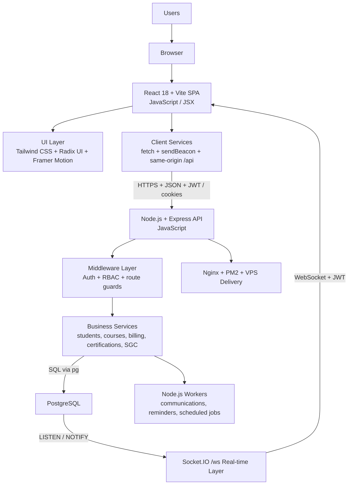

# ABYSS / STCW Technical Brief

ABYSS is a SaaS platform built and hardened over more than five years to run maritime training operations end to end. It is not a narrow back-office tool and it is not a prototype. It is the working product layer behind lead capture, student lifecycle, academic operations, certifications, invoicing, communications, reporting, student self-service, and ISO/SGC quality management in one integrated system.

This repository is the public technical brief for ABYSS. Its purpose is to make the scope, architecture, operational maturity, and engineering depth reviewable without exposing the production source tree, live datasets, billing artifacts, local secrets, or deployment-sensitive material.

## At a glance

| Dimension | Detail |
|-----------|--------|
| Product | `ABYSS` |
| Delivery model | Operational SaaS for maritime training centers |
| Maturity | 5+ years of development and production iteration |
| Live reference | `STCW España` |
| Functional breadth | 18 documented modules |
| User model | Internal multi-role operations + student self-service portal |
| Frontend | `React 18`, `Vite`, `Tailwind CSS`, `Radix UI`, `Framer Motion` |
| Backend | `Node.js`, `Express`, `PostgreSQL`, `Socket.IO` |
| Runtime support | `JWT auth`, `RBAC`, `workers`, `PM2`, `Nginx / VPS` |
| Expansion track | Tenant bootstrap · lead-to-student lifecycle · persistent SGC analytics |
| Review model | Public technical brief + private cleaned source review on request |

## What ABYSS does

ABYSS concentrates the operational spine of a maritime training center in one platform:

- lead capture and conversion
- student records and lifecycle management
- course templates, course instances, and academic operations
- attendance, assistance, evaluation, and dossier flows
- certifications, verification, and document-linked controls
- invoicing and finance-related workflows
- communications, workers, and scheduled processing
- reporting, management visibility, and KPIs
- student portal and self-service processes
- ISO/SGC quality, audits, objectives, risks, and DGMM-oriented control

## Why this is a SaaS, not a narrow internal app

ABYSS already behaves as a full operational product for a live training organization. The public brief presents it as such because that is the delivered reality:

- one coherent application shell with broad RBAC-governed module coverage
- backend services, workers, and business flows running in production conditions
- public and self-service flows such as portal access and verification routes
- business-critical modules operating together instead of as disconnected tools
- documented product evolution toward broader school and country reuse without permanent forks

The right public framing is `ABYSS`. `STCW España` is the live operating reference. This brief is intentionally written around the product, its delivered capabilities, and its operational maturity.

## Current module surface

The platform currently documents 18 modules with substantial operational coverage across commercial, academic, compliance, portal, finance, and quality domains:

| # | Module | Domain |
|---|--------|--------|
| 00 | Dashboard | Reporting / KPIs |
| 01 | Leads | Commercial pipeline |
| 02 | Students | Lifecycle management |
| 03 | Courses | Academic operations |
| 04 | Venue Resources | Calendar / resources |
| 05 | Career Plans | Academic planning |
| 06 | Career Packs | Bundle management |
| 07 | Academic Management | Attendance / evaluation |
| 08 | Technical Support | Tickets / follow-up |
| 09 | Certifications | Generation / verification |
| 10 | Invoicing | Billing / payments |
| 11 | Communications | Workers / bulk / health |
| 12 | Tasks | Kanban / automation |
| 13 | Reports | KPIs / scheduled reports |
| 14 | Users and Team | RBAC / permissions |
| 15 | Settings | Security / integrations |
| 16 | Student Portal | Self-service / mobile-first |
| 18 | Quality and SGC | ISO / audits / compliance |

See [Module Map](./docs/module-map.md).

## Role model and user surfaces

ABYSS is not a single-panel tool. It separates internal operations from student self-service and enforces access through role-aware UI and backend authorization.

Core internal roles documented in the runtime:

| Role | Primary focus |
|------|--------------|
| `admin` | Full system administration and configuration |
| `sales` | Lead pipeline, conversions, and commercial follow-up |
| `instructor` | Assigned courses, attendance, evaluations, certifications |
| `coordinator` | Cross-module academic and resource coordination |
| `support` | Assistance flows, tickets, and operational follow-up |
| `student` | Self-service portal — profile, courses, certs, invoices |

In addition, some sensitive operational and quality flows are explicitly protected for specialized roles such as `compliance`, `direction`, and guarded super-admin paths.

The runtime currently exposes three main visual surfaces:

- `internal operations shell` for administration, sales, academic operations, finance, support, reports, and quality
- `student portal shell` for profile, courses, quizzes, documents, certificates, invoices, messages, and support
- `public/utility views` for login, password reset, certificate preview/verification, and invoice verification

See [Role Model](./docs/role-model.md) and [Visual Surface](./docs/visual-surface.md).

## Operational maturity

One of the strongest signals in ABYSS is that it has not only breadth of modules, but also depth of production hardening:

- resolved authentication incidents and routing regressions
- resolved quiz and timeout defects affecting real student flows
- communications workers and automation safety controls
- invoice and certification verification flows
- documented post-mortems and operational fixes instead of ad-hoc patching
- quality/SGC coverage linked to real academic and documentary operations

This matters because serious software is not defined only by how many screens it has. It is defined by how it behaves under load, failure, change, and recovery in a live operation.

See [Production Hardening](./docs/production-hardening.md).

## Platform expansion status

ABYSS is no longer only a broad operational runtime. It also has a verifiable platform-expansion track that is already visible in the working system and in the technical planning produced around it.

What is publicly stated here is limited to what can be defended from the runtime and current documentation:

- config-driven tenant and country bootstrap already exists through runtime resolution and tenant packs
- a second tenant pack for `JJR Solutions` is already modeled as part of the expansion path
- a unified customer lifecycle timeline exists across lead, communication, enrollment, payment, and certification events
- the SGC layer already includes persistent KPI snapshots, scheduled materialization, and trend-oriented read APIs
- strategic specifications already exist for next-step domains such as `WhatsApp`, external payments, customer lifecycle visibility, and documentation prioritization

Important precision:

- this brief does **not** claim that every part of the multi-tenant platformization path is fully generalized and closed
- the defendable claim is stronger and more honest: ABYSS already has a real expansion base, a second tenant modeled, a lifecycle review surface, and an analytics persistence layer growing on top of the live product

See [Platform Expansion Status](./docs/platform-expansion-status.md), [Lifecycle Lead to Student](./docs/lifecycle-lead-student.md), [SGC Analytics Persistence](./docs/sgc-analytics-persistence.md), and the [Prompt Library](./prompts/README.md).

## Architecture summary

The active ABYSS runtime follows a production-oriented full-stack architecture:

- `React 18 + Vite` frontend written in `JavaScript / JSX`
- `Tailwind CSS`, `Radix UI`, `Framer Motion`, and charting/UI libraries in the browser layer
- client integration layer in `JavaScript` using `fetch`, `sendBeacon`, and service-based API access under same-origin `/api`
- `Node.js + Express` backend written in `JavaScript`, organized by routes, services, middleware, workers, and migrations
- `PostgreSQL` operational database accessed from Node through the `pg` driver and SQL-based schema/migration flows
- background workers in `Node.js` (`.js` / `.mjs`) for communications, reminders, scheduled jobs, and document-related processing
- JWT-based authentication, RBAC, and route-level permission checks
- `Socket.IO` real-time layer over `/ws`, backed by PostgreSQL `LISTEN / NOTIFY` for event propagation
- VPS-oriented backend operations with `Nginx`, `PM2`, separate app delivery, and production smoke/deploy tooling

High-level runtime view:

See [Architecture](./docs/architecture.md).

## Why this repository exists

The production working tree is too sensitive to publish directly. It mixes software layers with material that should not be made public, such as:

- local environment files and secrets
- billing artifacts and generated documents
- database files, dumps, and operational exports
- deployment-sensitive configuration and runbooks
- raw incident material with operational detail

For a serious evaluation, the correct model is:

- public technical brief for orientation
- private cleaned source repository for controlled review

See [Publication Boundary](./docs/publication-boundary.md).

## Evaluation path

If you are reviewing ABYSS:

1. Read this README as the system brief.
2. Review [Architecture](./docs/architecture.md) — stack, layers, topology, integration paths.
3. Review [Module Map](./docs/module-map.md) — 18 documented modules with per-module evidence.
4. Review [Platform Expansion Status](./docs/platform-expansion-status.md) — tenant bootstrap, second tenant, expansion direction.
5. Review [Lifecycle Lead to Student](./docs/lifecycle-lead-student.md) — unified timeline from first contact to certification.
6. Review [SGC Analytics Persistence](./docs/sgc-analytics-persistence.md) — KPI snapshots, scheduled materialization, trend APIs.
7. Review the [Prompt Library](./prompts/README.md) — structured engineering and product thinking behind next domains.
8. Review [Role Model](./docs/role-model.md) — multi-role RBAC with permission matrix.
9. Review [Visual Surface](./docs/visual-surface.md) — three distinct UX shells and capture policy.
10. Review [Production Hardening](./docs/production-hardening.md) — resolved incidents, engineering discipline, post-mortem culture.
11. Review [Publication Boundary](./docs/publication-boundary.md) — what is public, what is private, and how to request deeper access.

## Review access

If deeper technical review is required, the next step is controlled access to the private cleaned repository rather than broader public publication of the production tree.

**Request access:**

- Email: **robertgaraban@gmail.com** — Subject: `[Acceso repo privado] abyss-stcw-private`
- GitHub: [Robertgaraban](https://github.com/Robertgaraban)
- LinkedIn: [linkedin.com/in/robertgaraban](https://www.linkedin.com/in/robertgaraban)

**What is available under controlled access:**

- cleaned production source tree (frontend + backend)
- schema and migration files
- worker and automation code
- sanitized deployment and operations tooling
- selective post-mortem and incident record detail

## Código fuente

**Repositorio privado:** `Robertgaraban/abyss-stcw-private` — acceso como colaborador bajo solicitud

Solicitar acceso: **robertgaraban@gmail.com** — Asunto: `[Acceso repo privado] abyss-stcw-private`

## Notes

- This repository is a technical brief and due-diligence layer for ABYSS.
- It is not an open-source release of the production implementation.
- Source review is available under controlled access to the private cleaned repository.
- See [Architecture](./docs/architecture.md), [Module Map](./docs/module-map.md), [Platform Expansion Status](./docs/platform-expansion-status.md), [Lifecycle Lead to Student](./docs/lifecycle-lead-student.md), [SGC Analytics Persistence](./docs/sgc-analytics-persistence.md), the [Prompt Library](./prompts/README.md), [Role Model](./docs/role-model.md), [Visual Surface](./docs/visual-surface.md), [Production Hardening](./docs/production-hardening.md), [Publication Boundary](./docs/publication-boundary.md), and [Closeout](./docs/closeout.md).
