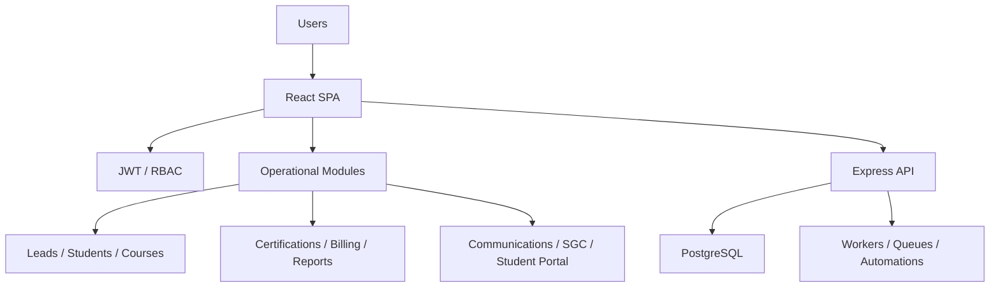

# ABYSS / STCW Technical Brief

ABYSS is the platform direction built from the active `CRM-STCW` runtime used for maritime training, academic operations, student lifecycle management, certifications, communications, billing, and quality processes.

This repository is a public technical brief. It exists to make the system scope, architecture, and engineering direction reviewable without exposing the production source tree, operational datasets, or deployment-sensitive material.

## At a glance

- Status: `active production runtime + ongoing platform extraction`
- Current runtime: `CRM-STCW`
- Platform direction: `ABYSS`
- Domain: `maritime training operations`, `student lifecycle`, `certifications`, `billing`, `communications`, `quality/SGC`
- Frontend: `React`, `Vite`
- Backend: `Express`, `PostgreSQL`
- Runtime support: `PM2 workers`, `JWT auth`, `RBAC`, `Nginx/VPS`, `Hostinger app delivery`
- Publication model: `public technical brief, private source review on request`

## What the system does

The current runtime is not a simple CRM. It combines multiple operational layers in one working system:

- lead capture and conversion
- student records and lifecycle management
- course management
- attendance and assistance tracking
- certifications and verification flows
- invoicing and finance-related workflows
- communications and automation queues
- role-based internal administration
- student portal capabilities
- ISO/SGC-oriented quality processes

## Current module surface

The documented module map currently includes:

- Dashboard
- Leads
- Students
- Courses
- Venue Resources
- Career Plans
- Career Packs
- Academic Management
- Technical Support
- Certifications
- Invoicing
- Communications
- Tasks
- Reports
- Users and Team
- Settings
- Student Portal
- Quality and SGC

See [Module Map](./docs/module-map.md).

## Architecture summary

The active runtime follows a split architecture:

- `React SPA` frontend
- `Express API` backend
- `PostgreSQL` operational database
- background workers for queued jobs and automations
- JWT-based authentication and RBAC
- VPS-oriented backend operations with a separate app delivery path

High-level runtime view:

See [Architecture](./docs/architecture.md).

## Platform direction vs. current code reality

The important distinction is this:

- `CRM-STCW` is the active runtime and operating codebase.
- `ABYSS` is the platform direction being extracted from that runtime.

The platform ambition includes reusable core capabilities, tenant separation, and country-specific adaptation without forking the system. However, the current codebase should still be understood as an active runtime under extraction, not as a fully sealed multi-tenant platform.

This matters because the public description should be technically honest:

- there is a real production system
- there is clear platform intent
- there is documented architecture work toward separation
- there is not yet a fully completed multi-tenant extraction in the current codebase

## Why this repository exists

This repository exists because the real codebase is too sensitive to publish directly.

The working tree contains operational artifacts that should not be exposed publicly, including:

- database files and dumps
- billing artifacts
- backups
- generated documents
- local environment files
- deployment-sensitive configuration
- internal incident and production runbook material

For a serious engineering review, the correct model is:

- public technical brief for orientation
- controlled access to a private cleaned source repository when needed

## Evaluation path

If you are reviewing this project:

1. Read this README as the system brief.
2. Review [Architecture](./docs/architecture.md).
3. Review [Module Map](./docs/module-map.md).
4. Review [Publication Boundary](./docs/publication-boundary.md).
5. Treat this repository as a due-diligence layer, not as a public source release.

## Review access

If deeper review is required, the appropriate next step is controlled access to the private cleaned repository, not broader public publication of the production tree.

Contact:

- GitHub: [Robertgaraban](https://github.com/Robertgaraban)
- LinkedIn: [linkedin.com/in/robertgaraban](https://www.linkedin.com/in/robertgaraban)

## Notes

- This repository is a technical brief and portfolio layer.
- It is not an open-source release of the production implementation.
- See [Architecture](./docs/architecture.md), [Module Map](./docs/module-map.md), [Publication Boundary](./docs/publication-boundary.md), and [Closeout](./docs/closeout.md).
