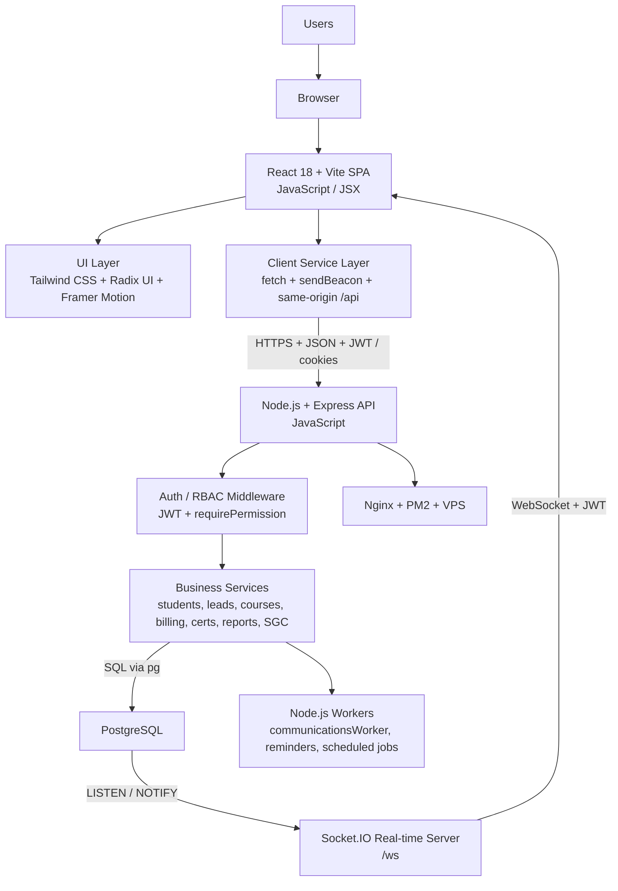

# Architecture

## Active ABYSS runtime

ABYSS is the active SaaS runtime used to operate the live STCW training organization. The public brief describes it as a product platform with current production depth, not as a lightweight internal tool.

The stack in the working system is:

- frontend SPA in `React 18 + Vite`, written in `JavaScript / JSX`
- browser UI layer using `Tailwind CSS`, `Radix UI`, `Framer Motion`, `Chart.js`, and related component libraries
- client integration layer in `JavaScript` using `fetch`, `sendBeacon`, and service clients under same-origin `/api`
- backend API in `Node.js + Express`, written in `JavaScript`
- operational data in `PostgreSQL`
- background workers in `Node.js` (`.js` / `.mjs`) for queues and scheduled automation jobs
- JWT authentication with RBAC guards and route-level permission enforcement
- `Socket.IO` real-time layer on `/ws`, backed by PostgreSQL `LISTEN / NOTIFY`
- VPS-oriented backend operation with `Nginx`, `PM2`, deploy scripts, smoke checks, and separate app delivery

## Technology map by layer

| Layer | Main language | Core technologies | How it connects |
|------|---------------|-------------------|-----------------|
| Browser shell | HTML / CSS / JavaScript | browser runtime, same-origin app shell | serves the SPA and utility/public views over HTTPS |
| Frontend application | `JavaScript / JSX` | `React 18`, `Vite`, `React Helmet` | renders admin shell, portal alumno, login, preview and verify views |
| UI and interaction | `JavaScript / JSX` + CSS | `Tailwind CSS`, `Radix UI`, `Framer Motion`, `Chart.js`, `lucide-react` | handles forms, dialogs, cards, dashboards, widgets, tables, and motion |
| Client integration | `JavaScript` | `fetch`, `sendBeacon`, service modules, same-origin `/api` strategy | sends JSON requests, browser metrics, auth refresh, and portal/admin API traffic |
| API runtime | `JavaScript` | `Node.js`, `Express` | exposes HTTP endpoints, applies middleware, auth, RBAC, and business routing |
| Authorization layer | `JavaScript` | JWT verification, `requirePermission(module, action)` middleware | protects admin routes, student routes, and sensitive operations |
| Service layer | `JavaScript` | modular services, controllers, runtime config | orchestrates business logic for students, courses, support, billing, certifications, reports, SGC |
| Data layer | SQL + `JavaScript` | `PostgreSQL`, `pg` driver, migrations/schema bootstrapping | persists operational entities and workflow state via SQL |
| Async processing | `JavaScript` / `.mjs` | Node workers, `PM2`, `node-cron`, job/state tables | processes communications, reminders, scheduled reports, document tasks, and retries |
| Real-time layer | `JavaScript` | `Socket.IO`, PostgreSQL `LISTEN / NOTIFY` | propagates selected DB-driven events to connected authenticated clients |
| Delivery / infra | shell + config | `Nginx`, `PM2`, VPS, app delivery tooling, smoke scripts | routes app and `/api`, keeps API/workers alive, and supports deploy/rollback workflows |

## Runtime topology

The deployed runtime joins multiple business domains inside one controlled system:

- commercial and admissions flows
- student records and lifecycle flows
- course templates, instances, and academic operations
- attendance, assistance, and evaluation flows
- certifications and verification flows
- billing and finance-related flows
- communications and background processing
- reporting and management KPIs
- student portal
- ISO/SGC quality processes

## Multi-user runtime split

ABYSS is also split by user surface, not only by business domain:

- internal operations shell for staff roles
- dedicated student portal for self-service access
- utility/public views for login, reset, certificate preview/verify, and invoice verification

The runtime root routes users into different visual shells depending on authentication state and role. This is a meaningful product-level distinction, not a cosmetic one.

## Integration paths between layers

The system is not only layered; it is connected through explicit technologies and protocols:

- `Browser -> SPA`: static app delivery over `HTTPS`
- `SPA -> API`: `HTTPS + JSON` using same-origin `/api`, with JWT, cookies, auth refresh, and browser-side telemetry
- `API -> PostgreSQL`: SQL over the Node `pg` driver
- `API -> Workers`: shared persistence and worker/job tables, plus coordinated runtime services
- `PostgreSQL -> Real-time layer`: `LISTEN / NOTIFY` channels consumed by `Socket.IO`
- `Socket.IO -> SPA`: authenticated `WebSocket` transport on `/ws`
- `Nginx / VPS -> App + API`: reverse-proxy routing, process supervision, and deploy/rollback control

## Core runtime flow

1. Users access the app shell.
2. The SPA, written in `JavaScript / JSX`, consumes the API through service clients and same-origin `/api`.
3. Auth refresh, JWT validation, and RBAC checks gate admin, portal, and verification flows.
4. The `Node.js + Express` backend routes requests through middleware and business services.
5. Services operate on PostgreSQL-backed business entities and traceable workflow state via SQL.
6. Workers process queued emails, scheduled reports, reminders, and automation jobs.
7. Selected database events are propagated to the real-time layer through PostgreSQL notifications and `Socket.IO`.

## Admin surface and self-service surface

The application shell mounts a broad module surface behind RBAC:

- dashboard
- students
- leads
- courses
- career packs
- career plans
- resources
- attendance
- assistance
- certifications
- invoicing
- communications
- tasks
- manual review
- reports
- users
- settings
- SGC

The broader product surface also includes:

- student portal flows
- certificate verification
- invoice verification
- password reset and access recovery

This is one of the clearest signs that ABYSS is a serious product runtime and not a one-feature system.

## Backend layers

The backend is organized around:

- routes
- services
- middleware
- utils
- migrations
- workers and jobs

These layers support business areas such as:

- pricing and billing
- communications and notifications
- permissions and RBAC
- academic and student operations
- document and certificate flows
- quality and audit-oriented controls

Operationally, this backend is a `Node.js` runtime using:

- `Express` for routing and middleware composition
- `pg` for PostgreSQL access
- JWT libraries and auth middleware for session control
- worker files in `.mjs` / `.js` for asynchronous processing
- deployment and smoke tooling for production verification

## Frontend layers

The frontend is organized around:

- auth and app-state contexts
- service clients by module
- operational components by business area
- shared UI primitives
- portal-oriented components for student flows

At technology level, this frontend combines:

- `React 18` component architecture
- `Vite` build and dev tooling
- `JavaScript / JSX` as the main implementation language
- `Tailwind CSS` for utility styling
- `Radix UI` primitives for accessible interaction patterns
- `Framer Motion` for animated transitions
- charting and metric presentation libraries for dashboards and reports

## Expanded runtime view

## Operational maturity

ABYSS shows production maturity through more than feature breadth:

- post-mortems exist for real production incidents
- authentication failures were diagnosed and corrected
- quiz timing and scoring regressions were resolved
- communications processing includes worker-oriented controls
- quality and SGC workflows are connected to real business operations

See [Production Hardening](./production-hardening.md).

## Growth model

ABYSS should be understood as a delivered SaaS runtime with a clear expansion path, not as an unfinished concept.

The public framing is:

- ABYSS is the product
- STCW España is the live operating reference
- the system already runs broad real-world operations today
- further school/country scaling is a platformization path built on top of a functioning core, not a substitute for one

That distinction matters because it preserves technical honesty without underselling the maturity that already exists.

## Verified expansion path

As of `2026-04-22`, the runtime also shows a concrete next-layer platform direction:

- configuration-based tenant and country bootstrap already exists
- a second tenant pack is already modeled
- customer lifecycle aggregation already spans lead, communication, enrollment, payment, and certification events
- the SGC module already persists analytical snapshots and exposes trend-oriented read APIs

The correct technical reading is not “fully generalized multi-tenant platform already complete”. The correct reading is stronger and more useful:

- the live product already has the operating depth
- the platformization work is already visible in runtime structure and supporting artifacts
- expansion is happening on top of a functioning SaaS core, not instead of one

See [Platform Expansion Status](./platform-expansion-status.md), [Lifecycle Lead to Student](./lifecycle-lead-student.md), and [SGC Analytics Persistence](./sgc-analytics-persistence.md).
