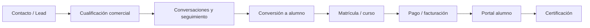

# Lifecycle Lead to Student

## Why this matters

One of the clearest signs that ABYSS is a serious operating platform is that the customer journey is not split across unrelated tools.

The lifecycle already spans commercial, academic, finance, and certification touchpoints. The current platform work makes that journey reviewable in one place.

## Lifecycle model

## What is already implemented

The current runtime already includes a unified timeline surface for customers.

Verified elements:

- backend endpoint: `GET /api/v1/customers/:id/timeline`
- permission gate: current access is protected through read permission on the commercial side
- frontend component: `CustomerTimeline.jsx`
- event aggregation across multiple domains using one chronological response

## Event types already covered

The timeline currently consolidates these event classes:

- `lead_created`
- `message`
- `enrollment`
- `payment`
- `certification`

That means the review surface already crosses module boundaries instead of showing isolated CRUD records.

## Operational meaning

This lifecycle view gives ABYSS a stronger product story because it links:

- admissions and sales follow-up
- academic progression
- billing events
- certification completion

For a reviewer, this is one of the most useful ways to understand that the system behaves like an operational backbone and not like a set of disconnected admin screens.

## Current public interpretation

The public claim should be:

- ABYSS already exposes a lifecycle review surface that connects commercial and academic events
- the journey is visible from first contact to certification
- the implementation exists in both backend and frontend layers

The brief should not claim that every lifecycle state or every channel is fully unified yet. The honest and stronger statement is that the unification work is already real and visible in the runtime.

## Related documents

- [Platform Expansion Status](./platform-expansion-status.md)
- [Architecture](./architecture.md)
- [Role Model](./role-model.md)
