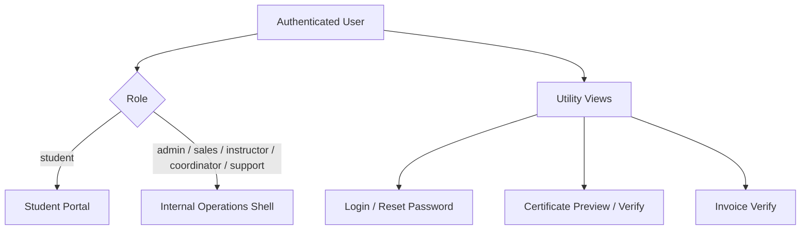

# Role Model

## Why the role model matters

ABYSS should be understood as a multi-user operational platform, not as a single back-office panel.

The runtime splits access by role, applies backend permission checks by module and action, and presents different shells depending on the user type.

## Main internal roles

The documented RBAC base currently includes these core roles:

| Role | Purpose | Representative capabilities |
|------|---------|-----------------------------|
| `admin` | Full operational administration | users, settings, billing full access, broad CRUD across business modules |
| `sales` | Commercial pipeline and conversion | leads, student follow-up, invoice creation, task coordination |
| `instructor` | Teaching and academic execution | assigned students/courses, attendance, grades/content, certifications |
| `coordinator` | Cross-functional academic operations | courses, resources, attendance, certifications, task orchestration |
| `support` | Support and follow-up | assistance flows, ticket work, operational follow-up |
| `student` | Self-service end user | own profile, own courses, documents, certificates, invoices, messages, support |

## Specialized protected roles

Some sensitive routes are additionally restricted for specialized functions beyond the base RBAC set, especially in quality-sensitive or operationally critical flows.

Examples documented in the runtime include:

- `compliance`
- `direction`
- guarded `super_admin` paths

This is important because it shows ABYSS is not only role-labelled in the UI. It also enforces differentiated access in backend routes and critical controls.

## Permission matrix by module

The table below shows representative access coverage per role. `full` = read + write + delete. `read` = read-only. `own` = own records only. `—` = no access.

| Module | admin | sales | instructor | coordinator | support | student |
|--------|-------|-------|------------|-------------|---------|---------|
| Dashboard | full | read | read | read | read | own |
| Leads | full | full | — | read | read | — |
| Students | full | full | read | full | read | — |
| Courses | full | read | read | full | read | — |
| Venue Resources | full | — | read | full | — | — |
| Career Plans | full | read | read | full | — | own |
| Career Packs | full | read | — | read | — | — |
| Academic Management | full | — | full | full | read | own |
| Technical Support | full | read | read | read | full | own |
| Certifications | full | — | full | full | — | own |
| Invoicing | full | full | — | read | — | own |
| Communications | full | full | — | read | read | — |
| Tasks | full | full | read | full | full | — |
| Reports | full | read | read | full | read | — |
| Users and Team | full | — | — | — | — | — |
| Settings | full | — | — | — | — | — |
| Student Portal | — | — | — | — | — | full |
| Quality and SGC | full | — | — | read | — | — |

> Actual enforcement is at the backend `requirePermission(module, action)` level. The table above reflects representative access patterns from the documented runtime.

## UI split by user type

ABYSS currently separates user experience at shell level:

## Internal operations shell

The internal shell mounts a broad RBAC-governed module surface behind authenticated access:

- dashboard
- leads
- students
- courses
- career packs
- career plans
- resources
- attendance
- assistance
- certifications
- invoicing
- communications
- tasks
- reports
- users
- settings
- SGC

## Student shell

The student role does not land in the internal panel. It is routed to a dedicated student portal with its own navigation and scoped data access.

The documented student surface includes:

- dashboard
- profile
- career plan
- courses
- quizzes
- materials
- documents
- certifications
- credentials
- roadmap
- attendance
- support
- invoicing
- messages

## Enforcement model

The role model is backed by:

- JWT-authenticated sessions
- backend `requirePermission(module, action)` checks
- route-level role restrictions where needed
- adaptive UI that hides unauthorized menus and actions
- student-only `/api/v1/me/*` endpoints for self-service data

## What this proves

This role model is one of the clearest indicators that ABYSS is a real operational SaaS:

- it supports multiple internal personas with different responsibilities
- it provides a separate student-facing product surface
- it enforces authorization in both UI and backend layers
- it is built around workflow ownership, not around a single operator profile
