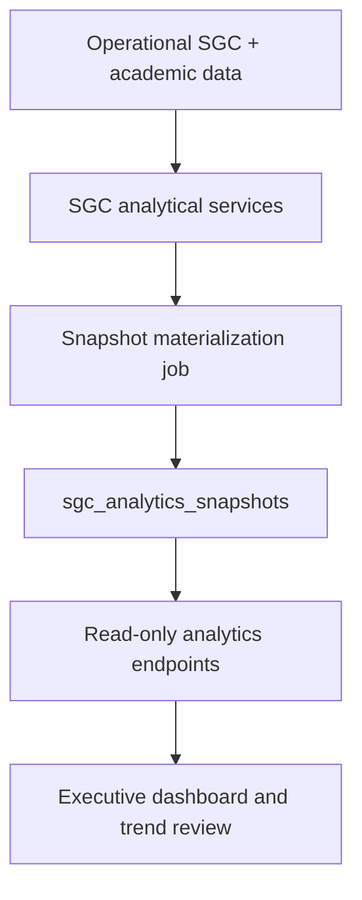

# SGC Analytics Persistence

## Why this matters

ABYSS quality management is not just document storage and audit checklists. The runtime already contains a much deeper analytical layer around quality objectives, satisfaction, documentary completeness, and executive indicators.

The recent platform work adds a persistence layer that makes those analytics more reusable and easier to consume over time.

## What already existed

Before the snapshot layer, the SGC module already operated with:

- advanced dashboard calculations
- KPI semaphores
- Likert-based satisfaction aggregation
- automatic sourcing from operational modules such as academic records and certifications
- DGMM-oriented documentary and compliance flows

This is important because the persistence layer is not starting from zero. It is being added on top of an already rich analytical service.

## What is now verifiable

The current runtime now includes:

- `sgc_analytics_snapshots` as a dedicated persistence table for historical KPI states
- a scheduled analytics materialization job
- read-oriented endpoints for latest state and historical trend retrieval

At public brief level, the correct statement is:

- ABYSS SGC already behaves like an analytical engine
- the platform now also persists analytical states for trend review and faster dashboards

## High-level flow



## Schema summary

```sql
-- Snapshot persistence table (public description only)
sgc_analytics_snapshots (
  id              uuid PRIMARY KEY,
  tenant_id       text NOT NULL,
  snapshot_date   date NOT NULL,
  kpi_data        jsonb NOT NULL,   -- structured KPI payload
  materialized_at timestamptz NOT NULL
)
```

Snapshots are keyed by `tenant_id` and `snapshot_date`, enabling both current-state queries and time-series comparisons across any period.

## API contract summary

```
GET /api/v1/sgc/analytics/latest
Authorization: Bearer <jwt>
Required permission: sgc:read
Returns: most recent snapshot for the authenticated tenant

GET /api/v1/sgc/analytics/history?from=YYYY-MM-DD&to=YYYY-MM-DD
Authorization: Bearer <jwt>
Required permission: sgc:read
Returns: array of snapshots within the date range, ordered chronologically
```

Both endpoints are read-only. Write path is handled by the materialization worker only.

## Scheduled materialization

The analytics job runs on a defined schedule using `node-cron`. It:

1. reads the current operational SGC state from the live service layer
2. serializes a structured KPI payload into the snapshot table
3. tags the snapshot with `tenant_id` and `materialized_at`
4. makes the result immediately available through the read APIs

The job is supervised by PM2 alongside the main API process.

## KPI categories covered

The snapshot payload currently includes indicators across these quality domains:

| Category | Example indicators |
|----------|-------------------|
| Documentary completeness | % of required documents filed per student/course |
| Certification compliance | % of eligible students certified on schedule |
| Satisfaction | Aggregated Likert scores from surveys |
| Academic objectives | Progress against defined quality targets |
| Audit trail | Open vs. closed audit items per period |

## What this proves

This persistence layer shows three important things:

- ABYSS is already linking quality and operations at data level
- the product is moving from transactional visibility to historical analytics
- the platform is being prepared for stronger executive reporting and external BI-style consumption

## Precision and current limits

This document also preserves technical honesty.

The public brief should not claim that the analytics layer is completely generalized across all future tenants yet.

The defendable claim is:

- tenant-tagged snapshot persistence already exists
- scheduled materialization already exists
- trend-oriented API support already exists
- further hardening toward more generalized tenant-aware analytics remains an active platform concern

## Related documents

- [Platform Expansion Status](./platform-expansion-status.md)
- [Architecture](./architecture.md)
- [Production Hardening](./production-hardening.md)