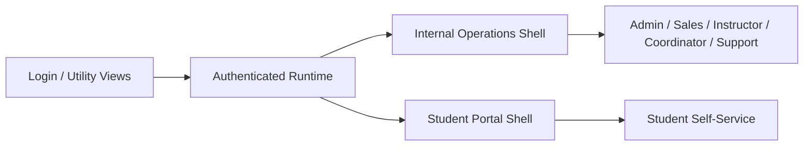

# Visual Surface

## Why the visual layer matters

ABYSS should not be read only as backend and process documentation. The product has differentiated visual surfaces for different user types and workflows.

Even without publishing sensitive runtime data, the public brief should make clear that the platform includes real UI depth across login, operations, portal, verification, and quality flows.

## Main visual surfaces

### 1. Internal operations shell

The internal shell is the operational workspace for staff and combines:

- sidebar navigation by module
- dashboard and KPI cards
- operational tables, forms, dialogs, and drawers
- billing, communications, reporting, and quality views
- role-sensitive module visibility

Representative UI modules in the runtime include:

- `DashboardOverview`
- `LeadsModule`
- `StudentsModule`
- `CoursesModule`
- `InvoicingModule`
- `CommunicationsModule`
- `ReportsModule`
- `UsersModule`
- `SettingsModule`
- `SgcModule`

### 2. Student portal shell

The student shell is visually distinct from the internal workspace and includes:

- mobile-first navigation
- dashboard widgets
- course and roadmap views
- quizzes and materials
- digital documents and signatures
- certificates, invoices, and support

Representative UI modules in the runtime include:

- `StudentPortal`
- `StudentDashboard`
- `StudentCourses`
- `StudentQuizzesModule`
- `StudentMaterialsModule`
- `StudentDocumentsModule`
- `StudentBillingView`
- `StudentMessages`
- `StudentAssistance`

### 3. Public and utility views

The product also includes utility and semi-public visual flows:

- high-fidelity login view
- account activation and password reset
- certificate preview and verification
- invoice verification

## Visual architecture by user surface

## Safe visual evidence for public presentation

The public repo should not contain screenshots with real student, billing, support, or audit data. The correct visual approach is curated and sanitized evidence.

Safe candidates for public screenshots:

- login page
- password reset or activation views without personal data
- certificate preview with dummy or sanitized payload
- student portal preview mode
- internal shell captured with demo/sanitized data
- navigation shells and empty states

Unsafe candidates for public screenshots:

- real student records
- real invoices or fiscal identifiers
- support tickets with personal content
- audit logs
- communications histories
- back-office lists with live operational data

## Capture plan

The correct capture sequence for ABYSS is:

1. login screen
2. internal dashboard shell with sanitized data
3. courses or students module with scrubbed values
4. student portal dashboard in preview or demo mode
5. student documents or roadmap screen in preview mode
6. SGC dashboard with sanitized or non-sensitive data

See [screenshots/README.md](../screenshots/README.md) for the capture policy.
